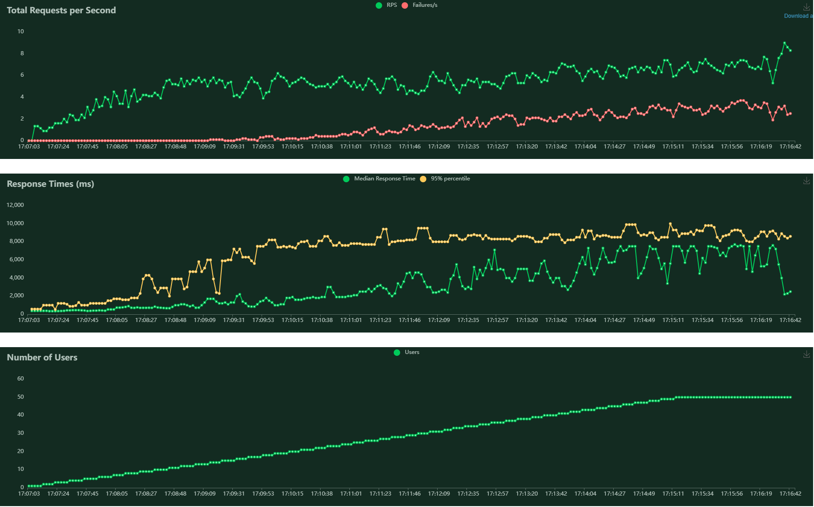

# Create Trainer
## POST
```
/trainers/
```

# Get Trainers
## GET
```
/trainers
```

# Get Trainer
## GET
```
/trainers/{trainer_id}
```

# Create Item For Trainer
## POST
```
/trainers/{trainer_id}/item/
```

# Create Pokemon For Trainer
## POST
```
/trainers/{trainer_id}/pokemon/
```

# Get Items
## GET
```
/items/
```

# Get Pokemons
## GET
```
/pokemons/
```

# Pokemons Battle
## GET
```
/pokemons/battle/{pokemonApiID}/{pokemonApiID2}
```
# Pokemons Random
## GET
```
/pokemons/random/
```

# PyLint
```
************* Module TP_tuc_examen.app.models
app\models.py:11:0: R0903: Too few public methods (0/2) (too-few-public-methods)
app\models.py:24:0: R0903: Too few public methods (0/2) (too-few-public-methods)
app\models.py:41:0: R0903: Too few public methods (0/2) (too-few-public-methods)
************* Module TP_tuc_examen.app.schemas
app\schemas.py:7:0: E0611: No name 'BaseModel' in module 'pydantic' (no-name-in-module)
app\schemas.py:12:0: R0903: Too few public methods (0/2) (too-few-public-methods)
app\schemas.py:19:0: R0903: Too few public methods (0/2) (too-few-public-methods)
app\schemas.py:31:4: R0903: Too few public methods (0/2) (too-few-public-methods)
app\schemas.py:24:0: R0903: Too few public methods (0/2) (too-few-public-methods)
app\schemas.py:40:0: R0903: Too few public methods (0/2) (too-few-public-methods)
app\schemas.py:47:0: R0903: Too few public methods (0/2) (too-few-public-methods)
app\schemas.py:60:4: R0903: Too few public methods (0/2) (too-few-public-methods)
app\schemas.py:52:0: R0903: Too few public methods (0/2) (too-few-public-methods)
app\schemas.py:68:0: R0903: Too few public methods (0/2) (too-few-public-methods)
app\schemas.py:75:0: R0903: Too few public methods (0/2) (too-few-public-methods)
app\schemas.py:88:4: R0903: Too few public methods (0/2) (too-few-public-methods)
app\schemas.py:80:0: R0903: Too few public methods (0/2) (too-few-public-methods)

------------------------------------------------------------------
Your code has been rated at 8.90/10 (previous run: 8.90/10, +0.00)
```

# PyTest
```
(venv) D:\media\Desktop\cours\EPSI\metodologie test\TP_tuc_examen>py -m pytest                                                             ========================================================== test session starts ===========================================================
platform win32 -- Python 3.9.7, pytest-7.1.3, pluggy-1.0.0
rootdir: D:\media\Desktop\cours\EPSI\metodologie test\TP_tuc_examen
plugins: anyio-3.6.1, hypothesis-6.56.2, mock-3.10.0, profiling-1.7.0
collected 12 items

tests\test_mocker.py .....                                                                                                          [ 41%]
tests\test_unit.py .......                                                                                                          [100%]

=========================================================== 12 passed in 5.25s ===========================================================
```


# Coverage
See "stats/result/index.html" 94%

# Locust
    Pour ce locust, nous allons créer 1 dresseur du nom de : “Katana”, celui ci aura comme pokémon un “Katagami d’id 798”, il affrontera le dresseur "ProfesseurIssou" qui existe et qui a comme pokémon un “Dracaufeu” d’id 6

